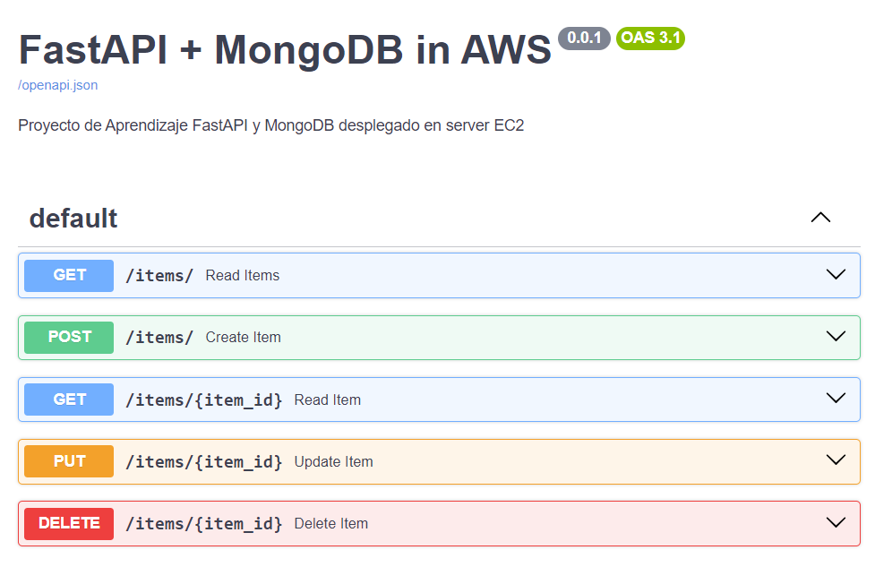

# Interconnect Python API with MongoDB in AWS




## Project Overview
This Cloud Project requires deploying the application (API) locally or on Railway (cloud provider), with integration to a MongoDB database hosted on AWS for CRUD operations. The architecture incorporates key tools and technologies including AWS, Railway, GitHub, FastAPI, Swagger, and MongoDB.

## Architecture
The project architecture includes:
- **API CRUD with FastAPI and MongoDB:** FastAPI is a modern, simple, high-performance and agile framework for building APIs with Python 3.7+. In this project we implement the 4 basic CRUD operations (get, post, put and delete) and a connection with MOngoDB as the NoSQL database.
- **Documentation auto-generated:** FastAPI automatically generates interactive API documentation using OpenAPI and JSON Schema. This is achieved through its integration with tools like Swagger UI and ReDoc.
- **Railway:** Railway is a cloud deployment platform that simplifies the process of deploying, managing, and scaling APIs and other applications.
- **Default VPC with auto assign of Public IP:** Use of default VPC with Auto assign of public IP to the EC2 server.
- **Security Groups:** Implemented as a firewall to control inbound and outbound traffic. Open ports SSH (22) and Mongo (27017). 
- **KeyPair:** Security and remote access through SSH involves the creation of keypairs.
- **MongoDB Server on EC2 Instance:** Configure OS, KeyPair, SecurityGroup, VPC and user data to automate the initial configuration process.
- **GitHub:** API files are stored on GitHub for version control and easy deployment.
- **EC2 Instance to Create AMI:** Once the website is installed, the EC2 instance is used to create an Amazon Machine Image (AMI) for future instances.

## Sequence Diagram

## Deployment Script of the MongoDB Server
Below is the bash script (user data) used to deploy the MongoDB server on an EC2 instance (Ubuntu 22.04 LTS):

```bash
#!/bin/bash
sudo apt-get update
sudo apt-get install -y gnupg curl
# Add MongoDB GPG key
curl -fsSL https://www.mongodb.org/static/pgp/server-7.0.asc | sudo gpg -o /usr/share/keyrings/mongodb-server-7.0.gpg --dearmor

# Create MongoDB source list file
echo "deb [ arch=amd64,arm64 signed-by=/usr/share/keyrings/mongodb-server-7.0.gpg ] https://repo.mongodb.org/apt/ubuntu jammy/mongodb-org/7.0 multiverse" | sudo tee /etc/apt/sources.list.d/mongodb-org-7.0.list
sudo apt-get update
sudo apt-get install -y mongodb-org
sudo systemctl start mongod

# Allow connections from any IP address by modifying the bindIp in mongod.conf
sudo sed -i 's/^  bindIp: .*/  bindIp: 0.0.0.0/' /etc/mongod.conf
sudo systemctl restart mongod
sudo systemctl enable mongod
```

## Deployment Steps
Deployment steps for the FastAPI application deployed on Railway and connected to MongoDB on AWS:

**MongoDB**
1. **VPC and Subnet Configuration on AWS**: Set up VPC with public and private subnets for resource segregation.
2. **Security Group Setup on AWS**: Configure inbound (22 and 27017 ports) and outbound traffic rules using security groups.
3. **Launch EC2 Instance on AWS**: Deploy Ubuntu 22.04 LTS AMI in the public subnet with an Elastic IP.
4. **MongoDB Server Deployment**: Use a bash script to install MongoDB, allowing connections from any IP. You can opt for user data field for automate creation.
5. **MongoDB String Connection**: Enter EC2 section inside the AWS Management Console to get the MongoDB string connection.
**API**
6. **GitHub**: Push the FastAPI application code to GitHub repository.
7. **Configure Environment Variables**: Configure API Ports and MongoDB string connection as Environment Variables.
8. **Railway Deployment**: Configure Railway to deploy the FastAPI application, pulling code directly from GitHub and using Environment Variables.
9. **Start FastAPI Application**: Run the FastAPI app with `uvicorn` binding to `0.0.0.0` for accessibility.
**Others**
10. **AMI Creation**: Create an Amazon Machine Image (AMI) from the configured EC2 instance for future deployments.
11. **Documentation and Testing**: FastAPI can autogenerate documentation through the use of the integrated toll Swagger. You can use the documentation page http://domain:port/docs for basic testing of the CRUD operations.

## Repository Structure
- `Deployment Script`: Contains the script for setting up the mongoDB on the EC2 instance
- `Architectural Diagram`: Visual representation of the overall architecture used
- `Sequence Diagram`: Visual representation of the sequence of the API operation.

## Additional Resources
- AWS Documentation: [EC2 User Guide](https://docs.aws.amazon.com/ec2/index.html)
- GitHub Repository for Webfiles: [leonomar8/fastapi-mongodb](https://github.com/leonomar8/fastapi-mongodb)
